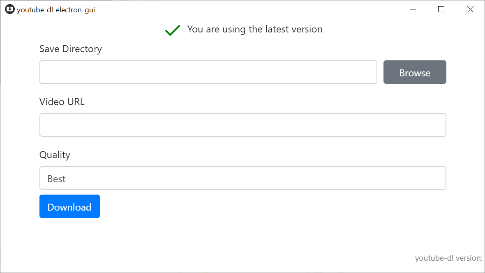

# youtube-dl-electron-gui

**youtube-dl-electron-gui** is a simple easy-to-use electron frontend to youtube-dl. It automatically manages youtube-dl updates, includes ffmpeg for HLS download support.

## Installation

**youtube-dl-electron-gui** is a standalone application with no dependencies. There is a Windows installer package as well as a portable version.
Downloads are available in the [Releases](https://github.com/karasevm/youtube-dl-electron-gui/releases/latest).
## Building

1. Clone the repo
2. Run yarn install
3. Place 32 bit executables for youtube-dl and ffmpeg into the `bin` folder
4. Run yarn dist 

## Built With

Actual video downloading is handled by the amazing [youtube-dl](https://github.com/ytdl-org/youtube-dl) and [ffmpeg](https://www.ffmpeg.org/)

Everything else: 
* [Node.js](https://github.com/nodejs/node)
* [Electron](https://github.com/electron/electron)
* [Bootstrap](https://getbootstrap.com/)

Based on [electron-quick-start](https://github.com/electron/electron-quick-start).

## License

[GPL-3.0](LICENSE.md)
