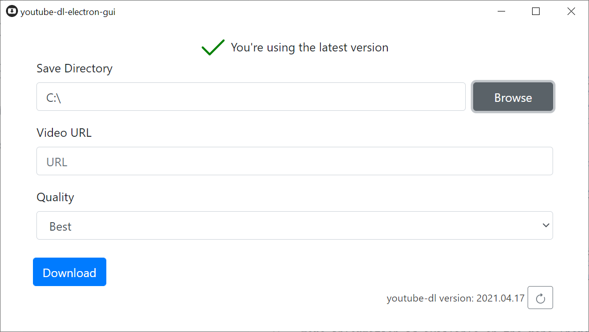

# youtube-dl-electron-gui

**youtube-dl-electron-gui** is a simple easy-to-use electron frontend to youtube-dl. It automatically manages youtube-dl updates, includes ffmpeg for HLS download support.

## Installation

**youtube-dl-electron-gui** is a standalone application with no dependencies. There is a Windows installer package as well as a portable version.
### Downloads
- [Windows x86](https://github.com/karasevm/youtube-dl-electron-gui/releases/latest/download/youtube-dl-electron-gui.exe)
- [Windows x86 portable](https://github.com/karasevm/youtube-dl-electron-gui/releases/latest/download/youtube-dl-electron-gui-portable.exe)

## Changes from version 1

- Completely rewritten in TypeScript
- Interface is now using React
- All logic moved to the main process
- Added support for translations

## Built With

Actual video downloading is handled by the amazing [youtube-dl](https://github.com/ytdl-org/youtube-dl) and [ffmpeg](https://www.ffmpeg.org/)

Everything else:

- [Node.js](https://github.com/nodejs/node)
- [Electron](https://github.com/electron/electron)
- [Bootstrap](https://getbootstrap.com/)
- [React](https://github.com/facebook/react/)

Based on [electron-react-boilerplate](https://github.com/electron-react-boilerplate/electron-react-boilerplate).

## Development

1. Clone the repo
2. Run `yarn`
3. Run `yarn start`

## TODO

1. Implement unit tests
2. Enable context isolation in Electron
3. Fix Linux/MacOS builds

## License

[GPL-3.0](LICENSE.md)
